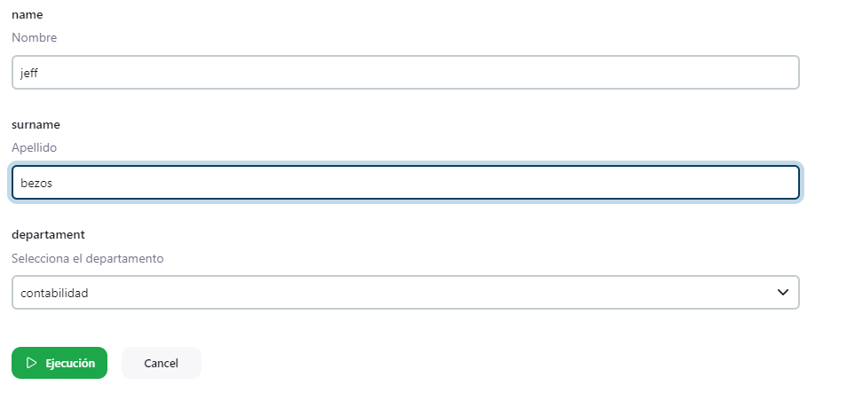
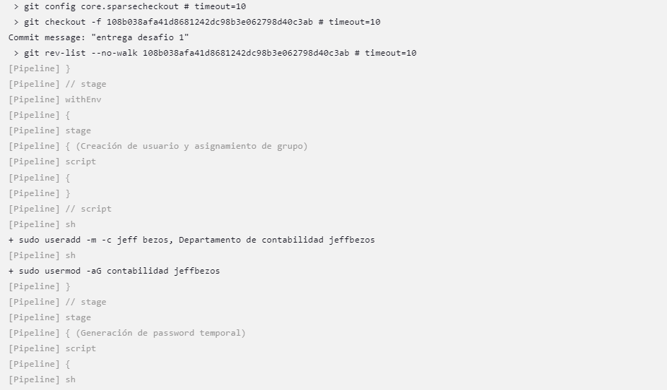

DOCUMENTACIÓN Y GUÍA DE UTILIZACIÓN DEL JOB

- En primer lugar, cumpliendo con las tareas de DevOps en el sistema en cuestión, he creado 3 grupos que conforman los departamentos solicitados: Contabilidad, Finanzas y Tecnología.
- Luego pasé a la creación del job, comenzando por la definición de dos variables: LOGIN y PASSWORD. En la variable LOGIN voy a almacenar la concatenación del nombre y apellido para la creación del usuario y demás configuraciones que se necesiten hacer con esta variable. En la variable PASSWORD voy a guardar la contraseña generada de forma aleatoria para asignarla posteriormente al usuario.
- En el siguiente paso, ya dentro del pipeline, defino los parámetros con los datos que debe ingresar el operador para la creación del usuario: "name" y "surname" con el tipo de datos string, y "departament" con el tipo de datos choice.
- En el útimo bloque de código están los stages, los cuáles los dividí en 3 para una mejor organización:
    - Creación de usuario y asignamiento de grupo.
    - Generación de password temporal.
    - Visualización de password temporal

CASO DE USO EXITOSO

- Con el comando "cat /etc/group" se muestran los grupos creados y los usuarios asignados a ellos.

- Solicito los datos de usuario (parámetros)

- Salida de consola

- Inicio de sesión del usuario y solicitación de cambio de contraseña
